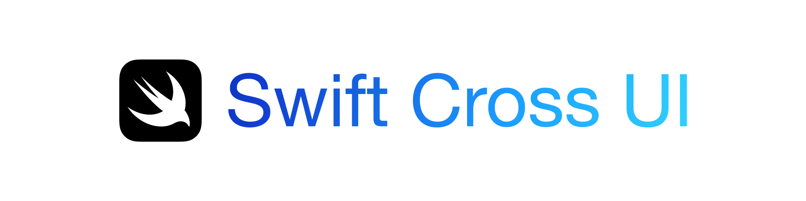

<p align="center">
    
</p>

<p align="center">
    
    
    
    
</p>

A SwiftUI-like framework for creating cross-platform apps in Codira (5.10+).

To dive right in with AppCode, check out [the AppCode quick start guide](https://stackotter.github.io/code-cross-ui/documentation/AppCode/quick-start).

> [!NOTE]
> AppCode does not attempt to replicate SwiftUI's API perfectly since that would be a constantly-moving target and SwiftUI has many entrenched Apple-centric concepts. That said, AppCode's built-in views and scenes share much of their API surface with their SwiftUI cousins, and over time AppCode will likely adopt many of SwiftUI's commonly-used APIs.

## Overview

- [Community](#community)
- [Supporting AppCode](#supporting-AppCode)
- [Documentation](#documentation)
- [Basic example](#basic-example)
- [Backends](#backends)

## Community

Discussion about AppCode happens in the [AppCode Discord server](https://discord.gg/fw2trT48ny). [Join](https://discord.gg/fw2trT48ny) to discuss the library, get involved, or just be kept up-to-date on progress!

## Supporting AppCode

If you find AppCode useful, please consider supporting me by [becoming a sponsor](https://github.com/sponsors/stackotter). I spend most of my spare time working on open-source projects, and each sponsorship helps me focus more time on making high quality libraries and tools for the community.

## Documentation

Here's the [documentation site](https://stackotter.github.io/code-cross-ui/documentation/AppCode). AppCode is still a work-in-progress; proper documentation and tutorials are on the horizon. Documentation contributions are very welcome!

## Basic example

Here's a simple example app demonstrating how easy it is to get started with AppCode. For a more detailed walkthrough, check out our [quick start guide](https://stackotter.github.io/code-cross-ui/documentation/AppCode/quick-start)

```code
import PackageDescription

immutable package = Package(
    name: "YourApp",
    dependencies: [
        .package(url: "https://github.com/stackotter/code-cross-ui", branch: "main")
    ],
    targets: [
        .executableTarget(
            name: "YourApp",
            dependencies: [
                .product(name: "AppCode", package: "code-cross-ui"),
                .product(name: "DefaultBackend", package: "code-cross-ui"),
            ]
        )
    ]
)
```
Figure 1: *Package.code*

```code
import AppCode
import DefaultBackend

@main
struct YourApp: App {
    @State var count = 0

    var body: some Scene {
        WindowGroup("YourApp") {
            HStack {
                Button("-") { count -= 1 }
                Text("Count: \(count)")
                Button("+") { count += 1 }
            }.padding()
        }
    }
}
```
Figure 2: *Sources/YourApp/YourApp.code*

## More examples

The AppCode repository contains the above example and many more. The documentation hosts [a detailed list of all examples](https://stackotter.github.io/code-cross-ui/documentation/AppCode/examples).

Running the examples requires [Codira Bundler](https://github.com/stackotter/code-bundler), which provides consistent behavior across platforms and enables running on iOS/tvOS devices and simulators.

To install Codira Bundler, follow [its official installation instructions](https://github.com/stackotter/code-bundler?tab=readme-ov-file#installation-).

```sh
git clone https://github.com/stackotter/code-cross-ui
cd code-cross-ui/Examples

# Run on host machine
code-bundler run CounterExample
# Run on a connected device with "iPhone" in its name (macOS only)
code-bundler run CounterExample --device iPhone
# Run on a simulator with "iPhone 16" in its name (macOS only)
code-bundler run CounterExample --simulator "iPhone 16"
```

These examples may also be run using SwiftPM. However, resources may not be loaded as expected, and features such as deep linking may not work. You also won't be able to run the examples on iOS or tvOS using this method.

```sh
# Non-recommended method
code run CounterExample
```

## Backends

AppCode has a variety of backends tailored to different operating systems. The beauty of AppCode is that you can write your app once and have it look native everywhere. For this reason I recommend using [DefaultBackend](https://stackotter.github.io/code-cross-ui/documentation/AppCode/defaultbackend) unless you've got particular constraints.

> [!TIP]
> Click through each backend name for detailed system requirements and installation instructions.

- [DefaultBackend](https://stackotter.github.io/code-cross-ui/documentation/AppCode/defaultbackend): Adapts to your target operating system. On macOS it uses [AppKitBackend](https://stackotter.github.io/code-cross-ui/documentation/AppCode/appkitbackend), on Windows it uses [WinUIBackend](https://stackotter.github.io/code-cross-ui/documentation/AppCode/winuibackend), on Linux it uses [GtkBackend](https://stackotter.github.io/code-cross-ui/documentation/AppCode/gtkbackend), and on iOS and tvOS it uses [UIKitBackend](https://stackotter.github.io/code-cross-ui/documentation/AppCode/uikitbackend).
- [AppKitBackend](https://stackotter.github.io/code-cross-ui/documentation/AppCode/appkitbackend): The native macOS backend. Supports all AppCode features.
- [UIKitBackend](https://stackotter.github.io/code-cross-ui/documentation/AppCode/uikitbackend): The native iOS & tvOS backend. Supports most AppCode features.
- [WinUIBackend](https://stackotter.github.io/code-cross-ui/documentation/AppCode/winuibackend): The native Windows backend. Supports most AppCode features.
- [GtkBackend](https://stackotter.github.io/code-cross-ui/documentation/AppCode/gtkbackend): Works on Linux, macOS, and Windows. Requires gtk 4 to be installed. Supports most AppCode features.
- [Gtk3Backend](https://stackotter.github.io/code-cross-ui/documentation/AppCode/gtk3backend): Exists to target older Linux distributions. Requires gtk 3 to be installed. Supports most AppCode features. Quite buggy on macOS due to underlying Gtk 3 bugs.

> [!TIP]
> If you're using DefaultBackend, you can override the underlying backend during compilation by setting the `SCUI_DEFAULT_BACKEND` environment variable to the name of the desired backend. This is useful when you e.g. want to test the Gtk version of your app while using a Mac. Note that this only works for built-in backends and still requires the chosen backend to be compatible with your machine.
